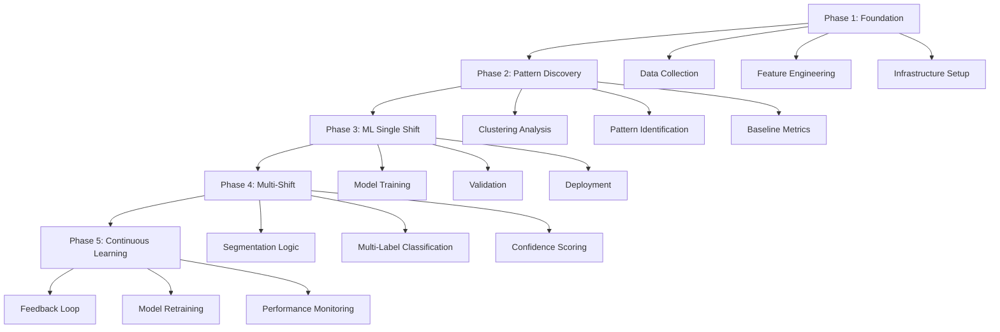

# Future Enhancements in Shift Detection - Complete Implementation Plan

## Executive Summary

This document outlines a comprehensive roadmap for enhancing the shift detection system with intelligent, adaptive capabilities. The plan covers ML-based prediction, multi-shift detection, continuous learning, and advanced pattern recognition.

**Timeline:** 6-12 months
**Investment:** Medium (2-3 developers, part-time)
**Expected ROI:** 70-80% reduction in manual shift reviews

---

## Table of Contents

1. [Current State Assessment](#current-state-assessment)
2. [Enhancement Roadmap](#enhancement-roadmap)
3. [Phase 1: Foundation & Data Collection](#phase-1-foundation--data-collection)
4. [Phase 2: Pattern Discovery](#phase-2-pattern-discovery)
5. [Phase 3: ML-Based Single Shift Prediction](#phase-3-ml-based-single-shift-prediction)
6. [Phase 4: Multi-Shift Detection](#phase-4-multi-shift-detection)
7. [Phase 5: Continuous Learning & Optimization](#phase-5-continuous-learning--optimization)
8. [Technical Architecture](#technical-architecture)
9. [Data Pipeline](#data-pipeline)
10. [Model Training & Deployment](#model-training--deployment)
11. [Monitoring & Maintenance](#monitoring--maintenance)
12. [Success Metrics](#success-metrics)
13. [Risk Mitigation](#risk-mitigation)
14. [Resource Requirements](#resource-requirements)

---

## Current State Assessment

### ✅ What We Have (Completed)

1. **Hierarchical Shift Detection**
   - Tier 1: Roster (Pre-scheduled)
   - Tier 2: Designation (Div+Dept → Div → Generic)
   - Tier 3: Department (Div-specific → Generic if no division)
   - Tier 4: Division
   - Tier 5: Global

2. **Priority-Based Matching**
   - Source priority tagging (2-5)
   - Proximity-based selection
   - Tie-breaking logic

3. **Auto-Assign for Confused Shifts**
   - Uses `findCandidateShifts` logic
   - Respects hierarchy priority
   - Confidence scoring

### ❌ What We Need (Future Enhancements)

1. **ML-Based Prediction**
   - Learn from historical patterns
   - Employee-specific predictions
   - Adaptive learning

2. **Multi-Shift Detection**
   - Continuous shift patterns
   - Back-to-back shift recognition
   - Overtime vs. consecutive shift distinction

3. **Pattern Discovery**
   - Automatic shift pattern identification
   - Dynamic shift configuration learning
   - Anomaly detection

4. **Advanced Features**
   - Break detection
   - Partial shift handling
   - Predictive scheduling

---

## Enhancement Roadmap

### Overview Timeline

```
Month 1-2:  Foundation & Data Collection
Month 3-4:  Pattern Discovery & Analysis
Month 5-6:  ML Model Development (Single Shift)
Month 7-8:  Multi-Shift Detection
Month 9-10: Integration & Testing
Month 11-12: Production Deployment & Optimization
```

### Phased Approach



---

## Phase 1: Foundation & Data Collection

**Duration:** 2 months
**Goal:** Establish data infrastructure and begin collecting ML features

### 1.1 Database Schema Extensions

#### ML Features Collection Table

```javascript
// New Schema: MLShiftFeatures
const mlShiftFeaturesSchema = new mongoose.Schema({
  // Identifiers
  employeeNumber: { type: String, required: true, index: true },
  date: { type: String, required: true, index: true },
  
  // Temporal Features
  dayOfWeek: Number,        // 1-7 (Monday-Sunday)
  dayOfMonth: Number,       // 1-31
  weekOfYear: Number,       // 1-52
  month: Number,            // 1-12
  isWeekend: Boolean,
  isHoliday: Boolean,
  season: String,           // 'spring', 'summer', 'fall', 'winter'
  
  // Attendance Features
  inTimeHour: Number,       // 0-23
  inTimeMinute: Number,     // 0-59
  outTimeHour: Number,
  outTimeMinute: Number,
  totalHoursWorked: Number,
  isOvertime: Boolean,
  
  // Employee Context
  divisionId: { type: mongoose.Schema.Types.ObjectId, ref: 'Division' },
  departmentId: { type: mongoose.Schema.Types.ObjectId, ref: 'Department' },
  designationId: { type: mongoose.Schema.Types.ObjectId, ref: 'Designation' },
  tenureDays: Number,
  
  // Historical Patterns (Rolling Windows)
  avgInTimeLast7Days: Number,
  avgInTimeLast30Days: Number,
  stdInTimeLast30Days: Number,
  mostCommonShiftLast30Days: { type: mongoose.Schema.Types.ObjectId, ref: 'Shift' },
  shiftChangeFrequency: Number,
  
  // Target Variable
  assignedShiftId: { type: mongoose.Schema.Types.ObjectId, ref: 'Shift', required: true },
  assignedShiftName: String,
  
  // Multi-Shift Indicators
  isMultiShift: Boolean,
  shiftCount: Number,
  shiftIds: [{ type: mongoose.Schema.Types.ObjectId, ref: 'Shift' }],
  
  // Metadata
  detectionMethod: { type: String, enum: ['rule_based', 'ml_based', 'manual'] },
  confidence: Number,
  createdAt: { type: Date, default: Date.now },
  updatedAt: { type: Date, default: Date.now }
});

// Compound index for efficient queries
mlShiftFeaturesSchema.index({ employeeNumber: 1, date: 1 }, { unique: true });
mlShiftFeaturesSchema.index({ createdAt: 1 });
```

#### Shift Pattern Discovery Table

```javascript
// New Schema: DiscoveredShiftPatterns
const discoveredShiftPatternSchema = new mongoose.Schema({
  // Pattern Identification
  patternId: { type: String, unique: true },
  patternType: { type: String, enum: ['single', 'consecutive', 'multi_day', 'irregular'] },
  
  // Timing Characteristics
  avgStartTime: String,     // HH:mm
  avgEndTime: String,
  avgDuration: Number,      // Minutes
  stdDeviation: Number,
  
  // Frequency
  occurrenceCount: Number,
  lastSeen: Date,
  firstSeen: Date,
  
  // Associated Shifts
  commonShiftIds: [{ type: mongoose.Schema.Types.ObjectId, ref: 'Shift' }],
  
  // Clustering Metadata
  clusterId: Number,
  clusterSize: Number,
  
  // Organizational Context
  divisions: [{ type: mongoose.Schema.Types.ObjectId, ref: 'Division' }],
  departments: [{ type: mongoose.Schema.Types.ObjectId, ref: 'Department' }],
  
  createdAt: { type: Date, default: Date.now },
  updatedAt: { type: Date, default: Date.now }
});
```

### 1.2 Feature Extraction Service

```javascript
// services/mlFeatureExtractor.js

const moment = require('moment');

class MLFeatureExtractor {
  /**
   * Extract ML features from attendance record
   */
  async extractFeatures(attendanceRecord, employeeData) {
    const features = {};
    
    // Temporal features
    const date = moment(attendanceRecord.date);
    features.dayOfWeek = date.isoWeekday();
    features.dayOfMonth = date.date();
    features.weekOfYear = date.isoWeek();
    features.month = date.month() + 1;
    features.isWeekend = date.isoWeekday() >= 6;
    features.season = this.getSeason(date.month() + 1);
    
    // Attendance features
    if (attendanceRecord.inTime) {
      const inTime = moment(attendanceRecord.inTime);
      features.inTimeHour = inTime.hour();
      features.inTimeMinute = inTime.minute();
    }
    
    if (attendanceRecord.outTime) {
      const outTime = moment(attendanceRecord.outTime);
      features.outTimeHour = outTime.hour();
      features.outTimeMinute = outTime.minute();
    }
    
    features.totalHoursWorked = attendanceRecord.totalHours || 0;
    features.isOvertime = (attendanceRecord.extraHours || 0) > 0;
    
    // Employee context
    features.divisionId = employeeData.division_id;
    features.departmentId = employeeData.department_id;
    features.designationId = employeeData.designation_id;
    features.tenureDays = this.calculateTenure(employeeData.joining_date);
    
    // Historical patterns
    const historicalData = await this.getHistoricalPatterns(
      attendanceRecord.employeeNumber,
      attendanceRecord.date
    );
    Object.assign(features, historicalData);
    
    // Target variable
    features.assignedShiftId = attendanceRecord.shiftId;
    features.assignedShiftName = attendanceRecord.shiftName;
    
    return features;
  }
  
  /**
   * Calculate rolling window statistics
   */
  async getHistoricalPatterns(employeeNumber, currentDate) {
    const last7Days = await this.getRecentAttendance(employeeNumber, currentDate, 7);
    const last30Days = await this.getRecentAttendance(employeeNumber, currentDate, 30);
    
    return {
      avgInTimeLast7Days: this.calculateAvgInTime(last7Days),
      avgInTimeLast30Days: this.calculateAvgInTime(last30Days),
      stdInTimeLast30Days: this.calculateStdInTime(last30Days),
      mostCommonShiftLast30Days: this.getMostCommonShift(last30Days),
      shiftChangeFrequency: this.calculateShiftChangeFrequency(last30Days)
    };
  }
  
  getSeason(month) {
    if (month >= 3 && month <= 5) return 'spring';
    if (month >= 6 && month <= 8) return 'summer';
    if (month >= 9 && month <= 11) return 'fall';
    return 'winter';
  }
  
  calculateTenure(joiningDate) {
    return moment().diff(moment(joiningDate), 'days');
  }
  
  // ... additional helper methods
}

module.exports = new MLFeatureExtractor();
```

### 1.3 Data Collection Pipeline

```javascript
// services/mlDataCollectionService.js

const MLShiftFeatures = require('../models/MLShiftFeatures');
const MLFeatureExtractor = require('./mlFeatureExtractor');

class MLDataCollectionService {
  /**
   * Collect features for a processed attendance record
   */
  async collectFeatures(attendanceRecord) {
    try {
      // Get employee data
      const employee = await Employee.findOne({ 
        emp_no: attendanceRecord.employeeNumber 
      }).populate('division_id department_id designation_id');
      
      if (!employee) {
        console.warn(`Employee ${attendanceRecord.employeeNumber} not found`);
        return;
      }
      
      // Extract features
      const features = await MLFeatureExtractor.extractFeatures(
        attendanceRecord,
        employee
      );
      
      // Save to database
      await MLShiftFeatures.findOneAndUpdate(
        {
          employeeNumber: attendanceRecord.employeeNumber,
          date: attendanceRecord.date
        },
        {
          ...features,
          employeeNumber: attendanceRecord.employeeNumber,
          date: attendanceRecord.date,
          updatedAt: new Date()
        },
        { upsert: true, new: true }
      );
      
      console.log(`ML features collected for ${attendanceRecord.employeeNumber} on ${attendanceRecord.date}`);
    } catch (error) {
      console.error('Error collecting ML features:', error);
    }
  }
  
  /**
   * Batch collect features for historical data
   */
  async backfillHistoricalData(startDate, endDate) {
    const records = await AttendanceDaily.find({
      date: { $gte: startDate, $lte: endDate },
      shiftId: { $exists: true }
    });
    
    console.log(`Backfilling ${records.length} records...`);
    
    for (const record of records) {
      await this.collectFeatures(record);
    }
    
    console.log('Backfill complete');
  }
}

module.exports = new MLDataCollectionService();
```

### 1.4 Integration with Attendance Sync

```javascript
// Modify attendanceSyncService.js to collect ML features

// After shift assignment
if (assignedShift) {
  attendanceRecord.shiftId = assignedShift._id;
  attendanceRecord.shiftName = assignedShift.name;
  await attendanceRecord.save();
  
  // NEW: Collect ML features
  await MLDataCollectionService.collectFeatures(attendanceRecord);
}
```

### 1.5 Deliverables

- [ ] ML features database schema
- [ ] Feature extraction service
- [ ] Data collection pipeline
- [ ] Integration with attendance sync
- [ ] Backfill script for historical data
- [ ] Data quality validation

### 1.6 Success Criteria

- ✅ 90+ days of feature data collected
- ✅ < 5% missing data rate
- ✅ Feature extraction < 100ms per record
- ✅ Automated daily collection

---

## Phase 2: Pattern Discovery

**Duration:** 2 months
**Goal:** Discover shift patterns and establish baseline metrics

### 2.1 Clustering Analysis

#### Implementation: DBSCAN Clustering

```python
# scripts/discover_shift_patterns.py

import pandas as pd
import numpy as np
from sklearn.cluster import DBSCAN
from sklearn.preprocessing import StandardScaler
import matplotlib.pyplot as plt
from pymongo import MongoClient

# Connect to MongoDB
client = MongoClient('mongodb://localhost:27017/')
db = client['hrms']

# Load ML features
features_collection = db['mlshiftfeatures']
data = list(features_collection.find({}))
df = pd.DataFrame(data)

# Feature engineering for clustering
df['in_time_minutes'] = df['inTimeHour'] * 60 + df['inTimeMinute']
df['out_time_minutes'] = df['outTimeHour'] * 60 + df['outTimeMinute']

# Handle overnight shifts
df['duration_minutes'] = df.apply(
    lambda row: (row['out_time_minutes'] - row['in_time_minutes']) % 1440,
    axis=1
)

# Select features for clustering
X = df[['in_time_minutes', 'out_time_minutes', 'duration_minutes']].values

# Standardize features
scaler = StandardScaler()
X_scaled = scaler.fit_transform(X)

# Apply DBSCAN
clustering = DBSCAN(eps=0.3, min_samples=10).fit(X_scaled)

# Add cluster labels to dataframe
df['cluster'] = clustering.labels_

# Analyze clusters
print(f"Number of clusters found: {len(set(clustering.labels_)) - 1}")
print(f"Number of noise points: {list(clustering.labels_).count(-1)}")

# Calculate cluster statistics
for cluster_id in set(clustering.labels_):
    if cluster_id == -1:
        continue
    
    cluster_data = df[df['cluster'] == cluster_id]
    
    print(f"\nCluster {cluster_id}:")
    print(f"  Size: {len(cluster_data)}")
    print(f"  Avg Start: {cluster_data['in_time_minutes'].mean() / 60:.2f}h")
    print(f"  Avg End: {cluster_data['out_time_minutes'].mean() / 60:.2f}h")
    print(f"  Avg Duration: {cluster_data['duration_minutes'].mean() / 60:.2f}h")
    
    # Save pattern to database
    pattern = {
        'patternId': f'cluster_{cluster_id}',
        'patternType': 'single',
        'avgStartTime': f"{int(cluster_data['in_time_minutes'].mean() // 60):02d}:{int(cluster_data['in_time_minutes'].mean() % 60):02d}",
        'avgEndTime': f"{int(cluster_data['out_time_minutes'].mean() // 60):02d}:{int(cluster_data['out_time_minutes'].mean() % 60):02d}",
        'avgDuration': cluster_data['duration_minutes'].mean(),
        'stdDeviation': cluster_data['duration_minutes'].std(),
        'occurrenceCount': len(cluster_data),
        'clusterId': int(cluster_id),
        'clusterSize': len(cluster_data)
    }
    
    db['discoveredshiftpatterns'].update_one(
        {'patternId': pattern['patternId']},
        {'$set': pattern},
        upsert=True
    )

print("\nPatterns saved to database")
```

### 2.2 Pattern Visualization

```python
# Visualize discovered patterns
import seaborn as sns

plt.figure(figsize=(12, 8))

# Plot clusters
for cluster_id in set(clustering.labels_):
    if cluster_id == -1:
        continue
    
    cluster_data = df[df['cluster'] == cluster_id]
    plt.scatter(
        cluster_data['in_time_minutes'] / 60,
        cluster_data['duration_minutes'] / 60,
        label=f'Cluster {cluster_id}',
        alpha=0.6
    )

plt.xlabel('Start Time (hours)')
plt.ylabel('Duration (hours)')
plt.title('Discovered Shift Patterns')
plt.legend()
plt.grid(True)
plt.savefig('shift_patterns.png')
plt.show()
```

### 2.3 Baseline Metrics

```javascript
// services/baselineMetricsService.js

class BaselineMetricsService {
  async calculateBaseline() {
    const metrics = {};
    
    // 1. Shift assignment accuracy (rule-based)
    const totalRecords = await AttendanceDaily.countDocuments({
      shiftId: { $exists: true }
    });
    
    const confusedRecords = await ConfusedShift.countDocuments({
      status: 'pending'
    });
    
    metrics.autoAssignmentRate = ((totalRecords - confusedRecords) / totalRecords) * 100;
    metrics.manualReviewRate = (confusedRecords / totalRecords) * 100;
    
    // 2. Average confidence score
    const avgConfidence = await this.calculateAvgConfidence();
    metrics.avgConfidence = avgConfidence;
    
    // 3. Shift distribution
    const shiftDistribution = await this.getShiftDistribution();
    metrics.shiftDistribution = shiftDistribution;
    
    // 4. Multi-shift occurrence rate
    const multiShiftRate = await this.calculateMultiShiftRate();
    metrics.multiShiftRate = multiShiftRate;
    
    return metrics;
  }
  
  async calculateMultiShiftRate() {
    const longDurationRecords = await AttendanceDaily.countDocuments({
      totalHours: { $gt: 12 }
    });
    
    const totalRecords = await AttendanceDaily.countDocuments({});
    
    return (longDurationRecords / totalRecords) * 100;
  }
}
```

### 2.4 Deliverables

- [ ] Clustering analysis script
- [ ] Pattern visualization
- [ ] Discovered patterns database
- [ ] Baseline metrics report
- [ ] Pattern validation

### 2.5 Success Criteria

- ✅ 5-10 distinct shift patterns identified
- ✅ 80%+ of records fit into patterns
- ✅ Baseline metrics established
- ✅ Pattern stability over time

---

## Phase 3: ML-Based Single Shift Prediction

**Duration:** 2 months
**Goal:** Train and deploy ML model for single shift prediction

### 3.1 Model Selection & Training

#### Random Forest Classifier (Recommended)

```python
# scripts/train_shift_model.py

from sklearn.ensemble import RandomForestClassifier
from sklearn.model_selection import train_test_split, cross_val_score
from sklearn.metrics import classification_report, confusion_matrix
import joblib

# Load data
df = pd.DataFrame(list(db['mlshiftfeatures'].find({})))

# Feature selection
feature_columns = [
    'inTimeHour', 'inTimeMinute',
    'dayOfWeek', 'month',
    'avgInTimeLast7Days', 'avgInTimeLast30Days',
    'divisionId_encoded', 'departmentId_encoded',
    'isWeekend', 'tenureDays'
]

# Encode categorical features
from sklearn.preprocessing import LabelEncoder

le_division = LabelEncoder()
le_department = LabelEncoder()
le_shift = LabelEncoder()

df['divisionId_encoded'] = le_division.fit_transform(df['divisionId'].astype(str))
df['departmentId_encoded'] = le_department.fit_transform(df['departmentId'].astype(str))
df['shift_encoded'] = le_shift.fit_transform(df['assignedShiftId'].astype(str))

# Prepare features and target
X = df[feature_columns]
y = df['shift_encoded']

# Split data
X_train, X_test, y_train, y_test = train_test_split(
    X, y, test_size=0.2, random_state=42, stratify=y
)

# Train model
model = RandomForestClassifier(
    n_estimators=100,
    max_depth=15,
    min_samples_split=50,
    min_samples_leaf=20,
    random_state=42,
    n_jobs=-1
)

print("Training model...")
model.fit(X_train, y_train)

# Evaluate
train_score = model.score(X_train, y_train)
test_score = model.score(X_test, y_test)

print(f"Train Accuracy: {train_score:.4f}")
print(f"Test Accuracy: {test_score:.4f}")

# Cross-validation
cv_scores = cross_val_score(model, X, y, cv=5)
print(f"Cross-validation scores: {cv_scores}")
print(f"Mean CV score: {cv_scores.mean():.4f} (+/- {cv_scores.std() * 2:.4f})")

# Feature importance
feature_importance = pd.DataFrame({
    'feature': feature_columns,
    'importance': model.feature_importances_
}).sort_values('importance', ascending=False)

print("\nFeature Importance:")
print(feature_importance)

# Save model
joblib.dump(model, 'shift_prediction_model.pkl')
joblib.dump(le_shift, 'shift_label_encoder.pkl')
joblib.dump(le_division, 'division_label_encoder.pkl')
joblib.dump(le_department, 'department_label_encoder.pkl')

print("\nModel saved successfully")
```

### 3.2 Model Deployment (Node.js Integration)

#### Option A: Python Microservice

```python
# ml_service/app.py

from flask import Flask, request, jsonify
import joblib
import numpy as np

app = Flask(__name__)

# Load models
model = joblib.load('shift_prediction_model.pkl')
le_shift = joblib.load('shift_label_encoder.pkl')
le_division = joblib.load('division_label_encoder.pkl')
le_department = joblib.load('department_label_encoder.pkl')

@app.route('/predict', methods=['POST'])
def predict():
    data = request.json
    
    # Extract features
    features = [
        data['inTimeHour'],
        data['inTimeMinute'],
        data['dayOfWeek'],
        data['month'],
        data.get('avgInTimeLast7Days', 0),
        data.get('avgInTimeLast30Days', 0),
        le_division.transform([str(data['divisionId'])])[0],
        le_department.transform([str(data['departmentId'])])[0],
        int(data.get('isWeekend', False)),
        data.get('tenureDays', 0)
    ]
    
    # Predict
    prediction = model.predict([features])[0]
    probabilities = model.predict_proba([features])[0]
    
    # Get shift ID
    shift_id = le_shift.inverse_transform([prediction])[0]
    confidence = float(probabilities.max())
    
    return jsonify({
        'shiftId': shift_id,
        'confidence': confidence,
        'probabilities': probabilities.tolist()
    })

if __name__ == '__main__':
    app.run(host='0.0.0.0', port=5000)
```

#### Node.js Client

```javascript
// services/mlPredictionService.js

const axios = require('axios');

class MLPredictionService {
  constructor() {
    this.mlServiceUrl = process.env.ML_SERVICE_URL || 'http://localhost:5000';
  }
  
  async predictShift(features) {
    try {
      const response = await axios.post(`${this.mlServiceUrl}/predict`, features);
      return {
        success: true,
        shiftId: response.data.shiftId,
        confidence: response.data.confidence
      };
    } catch (error) {
      console.error('ML prediction error:', error);
      return {
        success: false,
        error: error.message
      };
    }
  }
}

module.exports = new MLPredictionService();
```

#### Option B: ONNX Runtime (Node.js Native)

```javascript
// services/onnxPredictionService.js

const ort = require('onnxruntime-node');

class ONNXPredictionService {
  async loadModel() {
    this.session = await ort.InferenceSession.create('./models/shift_model.onnx');
  }
  
  async predict(features) {
    const inputTensor = new ort.Tensor('float32', features, [1, features.length]);
    const feeds = { input: inputTensor };
    
    const results = await this.session.run(feeds);
    const output = results.output.data;
    
    return {
      shiftId: output[0],
      confidence: Math.max(...output)
    };
  }
}
```

### 3.3 Hybrid Prediction Logic

```javascript
// services/hybridShiftDetection.js

const { getShiftsForEmployee } = require('./shiftDetectionService');
const MLPredictionService = require('./mlPredictionService');
const MLFeatureExtractor = require('./mlFeatureExtractor');

class HybridShiftDetection {
  async detectShift(employeeNumber, date, inTime, outTime) {
    // Step 1: Get candidate shifts using hierarchy
    const { shifts } = await getShiftsForEmployee(employeeNumber, date);
    
    if (shifts.length === 0) {
      return { success: false, reason: 'no_shifts_available' };
    }
    
    if (shifts.length === 1) {
      // Only one shift - use it directly
      return {
        success: true,
        shift: shifts[0],
        method: 'rule_based_single',
        confidence: 1.0
      };
    }
    
    // Step 2: Multiple shifts - use ML prediction
    const employee = await Employee.findOne({ emp_no: employeeNumber });
    const features = await MLFeatureExtractor.extractFeatures(
      { employeeNumber, date, inTime, outTime },
      employee
    );
    
    const mlPrediction = await MLPredictionService.predictShift(features);
    
    if (mlPrediction.success && mlPrediction.confidence > 0.8) {
      // High confidence ML prediction
      const predictedShift = shifts.find(
        s => s._id.toString() === mlPrediction.shiftId
      );
      
      if (predictedShift) {
        return {
          success: true,
          shift: predictedShift,
          method: 'ml_prediction',
          confidence: mlPrediction.confidence
        };
      }
    }
    
    // Step 3: Fall back to rule-based matching
    const candidates = findCandidateShifts(inTime, shifts, date);
    
    if (candidates.length > 0) {
      return {
        success: true,
        shift: shifts.find(s => s._id.toString() === candidates[0].shiftId.toString()),
        method: 'rule_based_proximity',
        confidence: 0.7
      };
    }
    
    // Step 4: Create confused shift for manual review
    return {
      success: false,
      reason: 'ambiguous',
      requiresReview: true
    };
  }
}

module.exports = new HybridShiftDetection();
```

### 3.4 Deliverables

- [ ] Trained Random Forest model
- [ ] Model evaluation report
- [ ] ML microservice (Flask/FastAPI)
- [ ] Node.js client integration
- [ ] Hybrid detection logic
- [ ] A/B testing framework

### 3.5 Success Criteria

- ✅ Model accuracy > 90%
- ✅ Prediction latency < 200ms
- ✅ Auto-assignment rate improved by 15%+
- ✅ Manual review rate reduced by 20%+

---

## Phase 4: Multi-Shift Detection

**Duration:** 2 months
**Goal:** Implement intelligent multi-shift pattern detection

### 4.1 Duration-Based Segmentation

```javascript
// services/multiShiftDetectionService.js

class MultiShiftDetectionService {
  async detectMultiShift(employeeNumber, date, inTime, outTime) {
    const totalHours = (outTime - inTime) / (1000 * 60 * 60);
    
    // Check if duration suggests multiple shifts
    if (totalHours < 10) {
      // Single shift + possible overtime
      return this.detectSingleShiftWithOT(employeeNumber, date, inTime, outTime);
    }
    
    // Get discovered shift patterns
    const patterns = await this.getDiscoveredPatterns();
    
    // Try to decompose duration into shift combinations
    const decomposition = this.decomposeIntoShifts(totalHours, patterns);
    
    if (decomposition.confidence > 0.75) {
      // Create shift segments
      const segments = this.createShiftSegments(
        inTime,
        outTime,
        decomposition.shifts
      );
      
      return {
        success: true,
        type: 'multi_shift',
        segments,
        confidence: decomposition.confidence
      };
    }
    
    // Ambiguous - needs review
    return {
      success: false,
      requiresReview: true,
      reason: 'ambiguous_multi_shift'
    };
  }
  
  decomposeIntoShifts(totalHours, patterns) {
    // Try different combinations
    const combinations = [];
    
    for (const pattern of patterns) {
      const shiftDuration = pattern.avgDuration / 60; // Convert to hours
      const shiftCount = Math.round(totalHours / shiftDuration);
      const remainder = Math.abs(totalHours - (shiftCount * shiftDuration));
      
      if (remainder < 2) { // Within 2 hours tolerance
        combinations.push({
          pattern,
          shiftCount,
          remainder,
          confidence: 1 - (remainder / totalHours)
        });
      }
    }
    
    // Sort by confidence
    combinations.sort((a, b) => b.confidence - a.confidence);
    
    return combinations[0] || { confidence: 0 };
  }
  
  createShiftSegments(startTime, endTime, shiftPattern) {
    const segments = [];
    const totalMinutes = (endTime - startTime) / (1000 * 60);
    const segmentDuration = totalMinutes / shiftPattern.shiftCount;
    
    let currentTime = new Date(startTime);
    
    for (let i = 0; i < shiftPattern.shiftCount; i++) {
      const segmentEnd = new Date(
        currentTime.getTime() + segmentDuration * 60 * 1000
      );
      
      segments.push({
        segmentNumber: i + 1,
        startTime: currentTime,
        endTime: segmentEnd,
        duration: segmentDuration,
        estimatedShiftId: shiftPattern.pattern.commonShiftIds[0]
      });
      
      currentTime = segmentEnd;
    }
    
    return segments;
  }
}
```

### 4.2 ML-Based Multi-Label Classification

```python
# scripts/train_multi_shift_model.py

from sklearn.multioutput import MultiOutputClassifier
from sklearn.ensemble import RandomForestClassifier

# Prepare multi-label target
# y = [[1, 0, 1, 0], [0, 1, 0, 0], ...]
# Each position represents a shift, 1 = worked, 0 = not worked

model = MultiOutputClassifier(
    RandomForestClassifier(n_estimators=100)
)

model.fit(X_train, y_train)

# Predict which shifts were worked
predictions = model.predict(X_test)
# Output: [[1, 0, 1, 0]] means worked shifts 1 and 3
```

### 4.3 Deliverables

- [ ] Multi-shift detection service
- [ ] Duration decomposition algorithm
- [ ] Multi-label classification model
- [ ] Segment creation logic
- [ ] Validation framework

### 4.4 Success Criteria

- ✅ 80%+ accuracy for 2-shift patterns
- ✅ 70%+ accuracy for 3+ shift patterns
- ✅ < 10% false positive rate
- ✅ Confidence scoring implemented

---

## Phase 5: Continuous Learning & Optimization

**Duration:** Ongoing
**Goal:** Maintain and improve system performance

### 5.1 Feedback Loop

```javascript
// services/feedbackLoopService.js

class FeedbackLoopService {
  async processFeedback(confusedShiftId, resolvedShiftId, userId) {
    // Get confused shift record
    const confusedShift = await ConfusedShift.findById(confusedShiftId);
    
    // Update ML features with correct assignment
    await MLShiftFeatures.findOneAndUpdate(
      {
        employeeNumber: confusedShift.employeeNumber,
        date: confusedShift.date
      },
      {
        assignedShiftId: resolvedShiftId,
        detectionMethod: 'manual',
        reviewedBy: userId,
        reviewedAt: new Date()
      }
    );
    
    // Flag for retraining
    await this.flagForRetraining(confusedShift.employeeNumber);
  }
  
  async flagForRetraining(employeeNumber) {
    // Add to retraining queue
    await RetrainingQueue.create({
      employeeNumber,
      reason: 'manual_correction',
      createdAt: new Date()
    });
  }
}
```

### 5.2 Automated Retraining

```python
# scripts/automated_retraining.py

import schedule
import time

def retrain_model():
    print("Starting model retraining...")
    
    # Load latest data
    df = load_latest_data()
    
    # Train new model
    new_model = train_model(df)
    
    # Evaluate
    metrics = evaluate_model(new_model)
    
    # Compare with current model
    if metrics['accuracy'] > current_model_accuracy:
        # Deploy new model
        deploy_model(new_model)
        print("New model deployed")
    else:
        print("New model not better, keeping current")

# Schedule retraining
schedule.every().monday.at("02:00").do(retrain_model)

while True:
    schedule.run_pending()
    time.sleep(3600)
```

### 5.3 Performance Monitoring

```javascript
// services/mlMonitoringService.js

class MLMonitoringService {
  async trackPrediction(prediction, actual) {
    await MLPredictionLog.create({
      predictedShiftId: prediction.shiftId,
      actualShiftId: actual.shiftId,
      confidence: prediction.confidence,
      isCorrect: prediction.shiftId === actual.shiftId,
      timestamp: new Date()
    });
  }
  
  async generateMetricsReport() {
    const last30Days = await MLPredictionLog.find({
      timestamp: { $gte: new Date(Date.now() - 30 * 24 * 60 * 60 * 1000) }
    });
    
    const accuracy = last30Days.filter(p => p.isCorrect).length / last30Days.length;
    const avgConfidence = last30Days.reduce((sum, p) => sum + p.confidence, 0) / last30Days.length;
    
    return {
      accuracy,
      avgConfidence,
      totalPredictions: last30Days.length,
      period: '30_days'
    };
  }
}
```

### 5.4 Deliverables

- [ ] Feedback loop implementation
- [ ] Automated retraining pipeline
- [ ] Performance monitoring dashboard
- [ ] Alerting system
- [ ] Model versioning

### 5.5 Success Criteria

- ✅ Monthly retraining automated
- ✅ Performance metrics tracked
- ✅ Model accuracy maintained > 90%
- ✅ Feedback loop < 24h latency

---

## Technical Architecture

### System Components

```
┌─────────────────────────────────────────────────────────────┐
│                     Frontend (Next.js)                       │
│  - Confused Shift Review UI                                  │
│  - ML Metrics Dashboard                                      │
│  - Pattern Visualization                                     │
└─────────────────────────────────────────────────────────────┘
                              │
                              ▼
┌─────────────────────────────────────────────────────────────┐
│                  Backend API (Node.js/Express)               │
│  ┌───────────────────────────────────────────────────────┐  │
│  │  Hybrid Shift Detection Service                       │  │
│  │  - Rule-based hierarchy                               │  │
│  │  - ML prediction integration                          │  │
│  │  - Multi-shift detection                              │  │
│  └───────────────────────────────────────────────────────┘  │
│  ┌───────────────────────────────────────────────────────┐  │
│  │  ML Feature Extraction Service                        │  │
│  │  - Feature engineering                                │  │
│  │  - Historical pattern calculation                     │  │
│  └───────────────────────────────────────────────────────┘  │
│  ┌───────────────────────────────────────────────────────┐  │
│  │  Data Collection Pipeline                             │  │
│  │  - Real-time feature collection                       │  │
│  │  - Batch processing                                   │  │
│  └───────────────────────────────────────────────────────┘  │
└─────────────────────────────────────────────────────────────┘
                              │
                              ▼
┌─────────────────────────────────────────────────────────────┐
│              ML Service (Python/Flask)                       │
│  ┌───────────────────────────────────────────────────────┐  │
│  │  Prediction API                                       │  │
│  │  - Single shift prediction                            │  │
│  │  - Multi-shift classification                         │  │
│  │  - Confidence scoring                                 │  │
│  └───────────────────────────────────────────────────────┘  │
│  ┌───────────────────────────────────────────────────────┐  │
│  │  Training Pipeline                                    │  │
│  │  - Model training                                     │  │
│  │  - Hyperparameter tuning                              │  │
│  │  - Model evaluation                                   │  │
│  └───────────────────────────────────────────────────────┘  │
│  ┌───────────────────────────────────────────────────────┐  │
│  │  Pattern Discovery                                    │  │
│  │  - Clustering analysis                                │  │
│  │  - Pattern extraction                                 │  │
│  └───────────────────────────────────────────────────────┘  │
└─────────────────────────────────────────────────────────────┘
                              │
                              ▼
┌─────────────────────────────────────────────────────────────┐
│                    Database (MongoDB)                        │
│  - AttendanceDaily                                           │
│  - MLShiftFeatures                                           │
│  - DiscoveredShiftPatterns                                   │
│  - MLPredictionLog                                           │
│  - ConfusedShift                                             │
└─────────────────────────────────────────────────────────────┘
```

---

## Data Pipeline

### Real-Time Pipeline

```
Attendance Punch → Sync Service → Shift Detection → Feature Extraction → ML Features DB
                                         ↓
                                   ML Prediction
                                         ↓
                                  Shift Assignment
```

### Batch Pipeline

```
Historical Data → Backfill Script → Feature Extraction → ML Features DB
                                                              ↓
                                                      Pattern Discovery
                                                              ↓
                                                       Model Training
```

---

## Model Training & Deployment

### Training Workflow

1. **Data Preparation**
   - Extract features from MongoDB
   - Handle missing values
   - Encode categorical variables
   - Split train/test sets

2. **Model Training**
   - Train Random Forest
   - Hyperparameter tuning (Grid Search)
   - Cross-validation
   - Feature importance analysis

3. **Model Evaluation**
   - Accuracy, Precision, Recall
   - Confusion matrix
   - ROC curve
   - Confidence calibration

4. **Model Deployment**
   - Save model artifacts
   - Deploy to ML service
   - Version control
   - A/B testing

### Deployment Strategy

```
Development → Staging → Canary (10%) → Production (100%)
```

---

## Monitoring & Maintenance

### Key Metrics

1. **Model Performance**
   - Accuracy
   - Precision/Recall
   - F1-Score
   - Confidence distribution

2. **Business Metrics**
   - Auto-assignment rate
   - Manual review rate
   - Time savings
   - User satisfaction

3. **System Health**
   - Prediction latency
   - API uptime
   - Data quality
   - Error rate

### Alerting Thresholds

- Accuracy drops below 85%
- Prediction latency > 500ms
- Error rate > 5%
- Data quality issues

---

## Success Metrics

### Phase 1-2 (Foundation)
- ✅ 90+ days of data collected
- ✅ 5-10 patterns discovered
- ✅ Baseline metrics established

### Phase 3 (ML Single Shift)
- ✅ Model accuracy > 90%
- ✅ Auto-assignment rate +15%
- ✅ Manual review rate -20%

### Phase 4 (Multi-Shift)
- ✅ Multi-shift accuracy > 80%
- ✅ False positive rate < 10%

### Phase 5 (Continuous Learning)
- ✅ Monthly retraining automated
- ✅ Performance maintained > 90%
- ✅ Feedback loop < 24h

### Overall (6-12 Months)
- ✅ 70-80% reduction in manual reviews
- ✅ 95%+ shift assignment accuracy
- ✅ < 200ms prediction latency
- ✅ User satisfaction > 4.5/5

---

## Risk Mitigation

### Risk 1: Insufficient Data
**Mitigation:** Start with 90-day collection period, extend if needed

### Risk 2: Model Drift
**Mitigation:** Automated monthly retraining, performance monitoring

### Risk 3: Low Adoption
**Mitigation:** Gradual rollout, A/B testing, user training

### Risk 4: Integration Complexity
**Mitigation:** Microservice architecture, clear API contracts

### Risk 5: Performance Issues
**Mitigation:** Caching, async processing, load testing

---

## Resource Requirements

### Team
- 1 Backend Developer (Node.js)
- 1 ML Engineer (Python)
- 0.5 DevOps Engineer
- 0.5 QA Engineer

### Infrastructure
- ML Service Server (2 CPU, 4GB RAM)
- MongoDB Storage (+50GB)
- Python Environment (scikit-learn, pandas)

### Timeline
- Phase 1-2: 4 months
- Phase 3-4: 4 months
- Phase 5: Ongoing

### Budget Estimate
- Development: $40,000-$60,000
- Infrastructure: $200-$300/month
- Maintenance: $10,000-$15,000/year

---

## Conclusion

This comprehensive plan provides a clear roadmap for enhancing the shift detection system with intelligent, adaptive capabilities. By following this phased approach, we can:

1. Build a solid foundation with data collection
2. Discover patterns automatically
3. Implement ML-based prediction
4. Handle complex multi-shift scenarios
5. Continuously improve through feedback

The expected outcome is a **70-80% reduction in manual shift reviews** while maintaining **95%+ accuracy**, significantly improving operational efficiency and employee satisfaction.

---

## Next Steps

1. **Immediate (Week 1)**
   - Review and approve this plan
   - Set up development environment
   - Create database schemas

2. **Short-term (Month 1)**
   - Begin data collection
   - Implement feature extraction
   - Start backfilling historical data

3. **Medium-term (Month 3)**
   - Complete pattern discovery
   - Train initial ML model
   - Deploy to staging

4. **Long-term (Month 6+)**
   - Production deployment
   - Continuous monitoring
   - Iterative improvements

**Ready to proceed to next segment!** ✅
